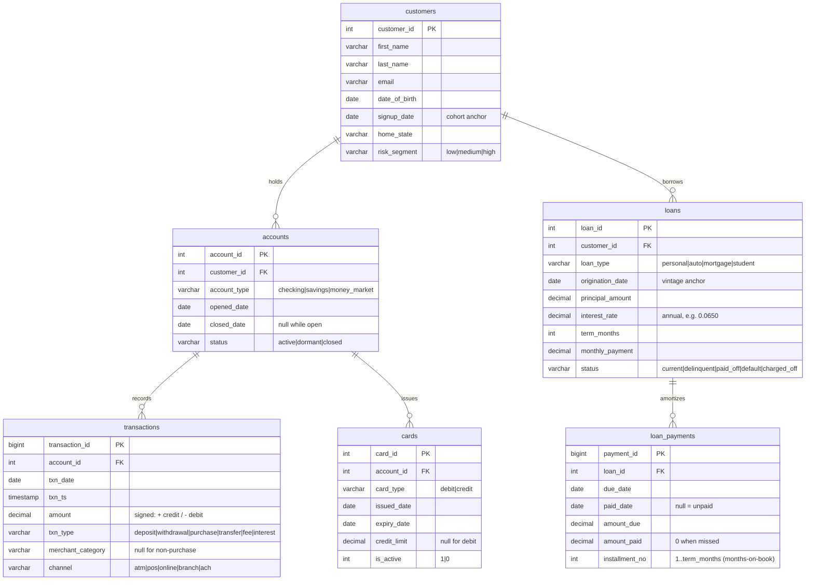

# Entity-Relationship Diagram

The schema models a retail-banking relationship: customers hold deposit
**accounts**, accounts generate **transactions** and carry payment **cards**,
and customers separately hold **loans** that amortize through **loan_payments**.

## Grain notes

| Table          | Grain (one row per ...)                          |
|----------------|--------------------------------------------------|
| `customers`    | customer / household head                        |
| `accounts`     | deposit product held by a customer               |
| `transactions` | posted money movement on an account              |
| `cards`        | payment card linked to an account                |
| `loans`        | originated loan held by a customer               |
| `loan_payments`| scheduled installment for a loan                 |

## Sign convention

`transactions.amount` is **signed**: positive = credit / inflow (deposit,
interest), negative = debit / outflow (withdrawal, purchase, fee). Running
balances simply cumulatively sum the signed amount; spend metrics take
`ABS(amount)` filtered to `amount < 0`.
